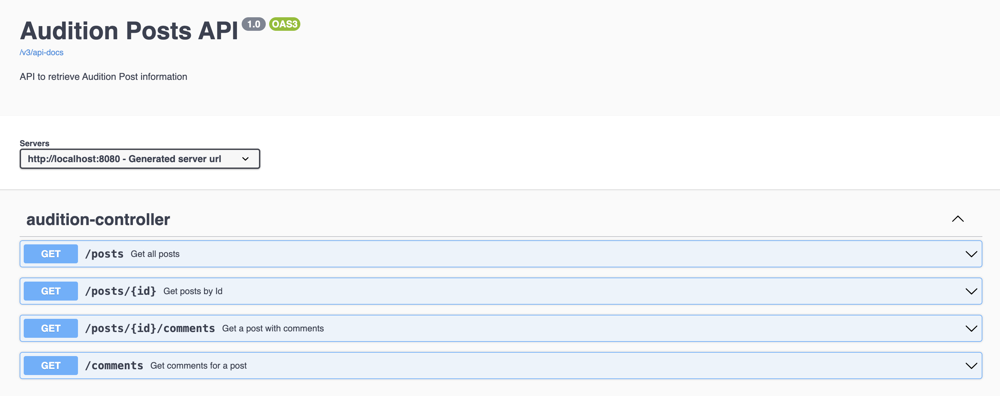
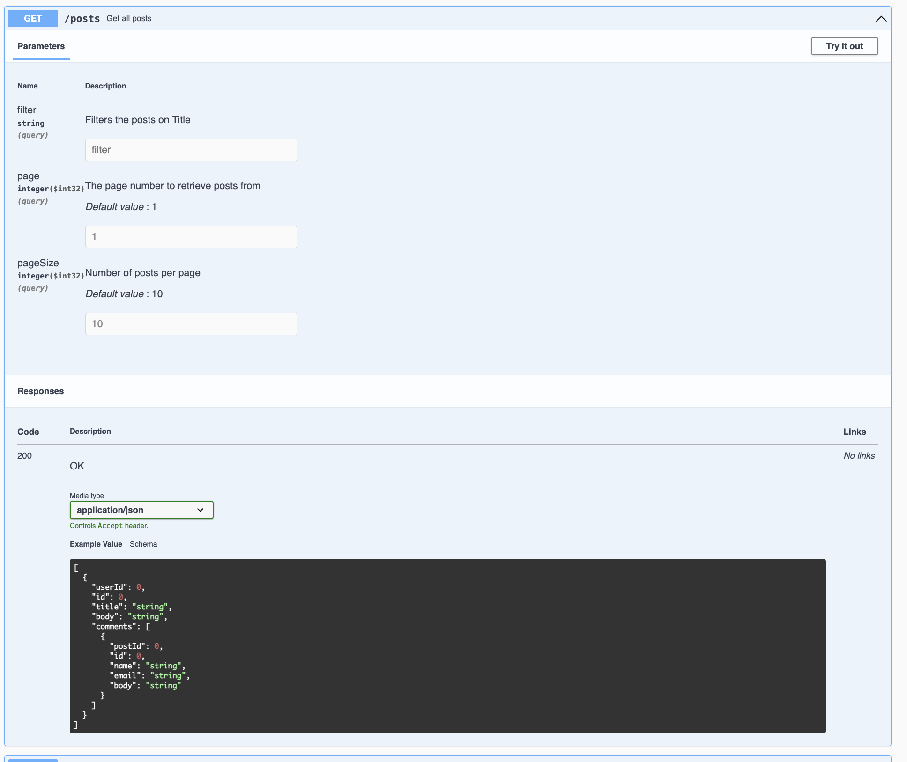

# Documenting the Audition API Spring Boot Application

To ensure seamless usage, configuration, and maintenance of the audition-api, comprehensive documentation is imperative. This documentation should cater to developers, users, and stakeholders with varying interests in different facets of the application.

## Key Areas for Documentation:

### 1. API Documentation using Swagger/OpenAPI
Utilizing annotations such as `@Api`, `@ApiOperation`, `@ApiParam`, and `@Parameter` facilitates the comprehensive documentation of our RESTful APIs. This results in interactive documentation delineating endpoints, request/response formats, and parameter details.

For instance, in this assignment I have used Swagger to document our APIs. Documentation is accessible via [http://localhost:8080/swagger-ui/index.html](http://localhost:8080/swagger-ui/index.html).





### 2. Javadoc Comments
In the codebase, detailed Javadoc comments elucidate the purpose, functionality, and usage of classes/methods. These annotations significantly benefit developers directly engaged with the code.

e.g. 
```    /**
     * Get all posts limited by pagination params
     * @param page - The page number for pagination.
     * @param pageSize - pageSize The size of each page.
     * @return A list of AuditionPost objects representing posts based on pagination.
     */
    public List<AuditionPost> getPosts(final int page, final int pageSize) {
        final List<AuditionPost> allPosts =  auditionIntegrationClient.getPosts();
        return getPaginatedResults(allPosts, page, pageSize);
    }
```

### 3. README File
At the project's root, a well-structured README file articulates the application's purpose, features, installation guidelines, configuration procedures, and execution instructions.
Depending on the project, it might encompass sections such as "Configuration and Environment Setup" and "Spring Profiles".

### 4. Code Comments
It is a good practice to add comments to explain complex logic, assumptions, or any non-obvious implementation details.
We should avoid over-commenting, but make sure the intent behind critical sections is clear.

```       
 // If page is greater than totalPages, then set page to total number of pages (last page)
        final int pageToReturn = page > totalPages ? totalPages : page;
```

### 5. Maintenance and Contribution Guidelines
If the project is open-source or involves contributions, we should outline guidelines for contributing, reporting issues, and code maintenance