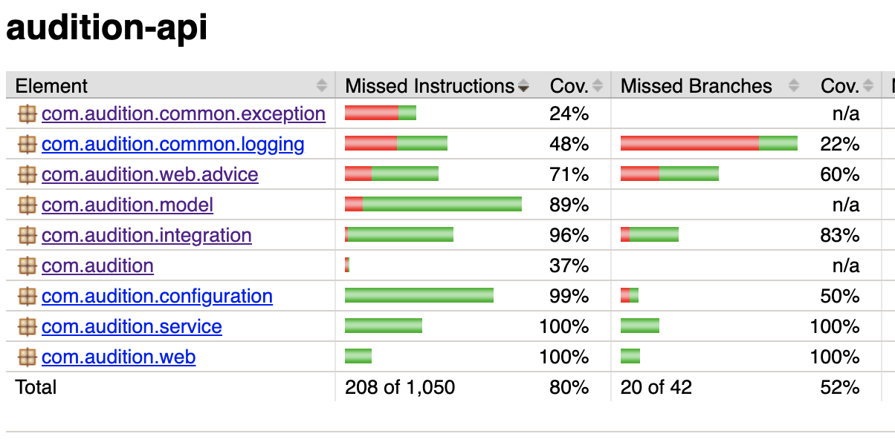
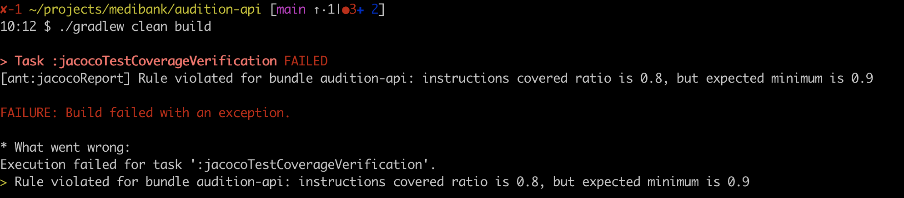

| Expectation | Status | Comments |
|----------|----------|----------|
| Build successful | &#x2713;  |   |
| Test coverage at least 80%   | &#x2713;   |   |
| Build fails if coverage less than configured limit  | &#x2713;   |   |
| Static code analysis (PMD, SpotBugs, Checkstyle)   | &#x2713;   |   |
| Application is functional   | &#x2713;   |   |
| Logging, metrics, instrumentation   | &#x2713;   |   |
| Input validation   | &#x2713;   |  Covered in SpringBootTest too |